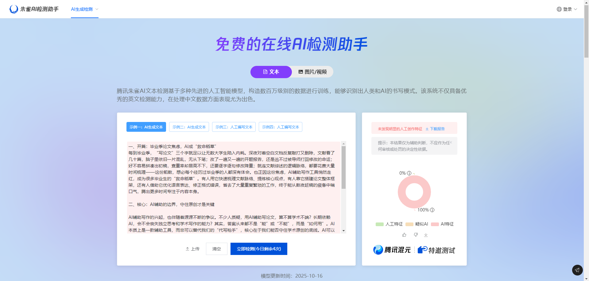
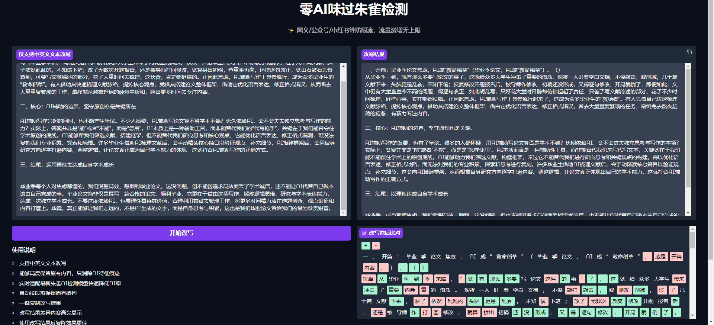
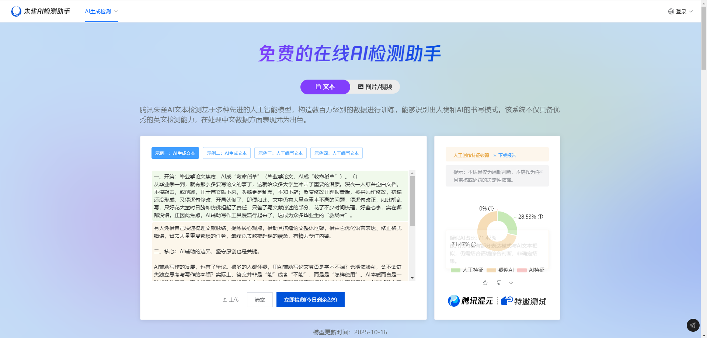
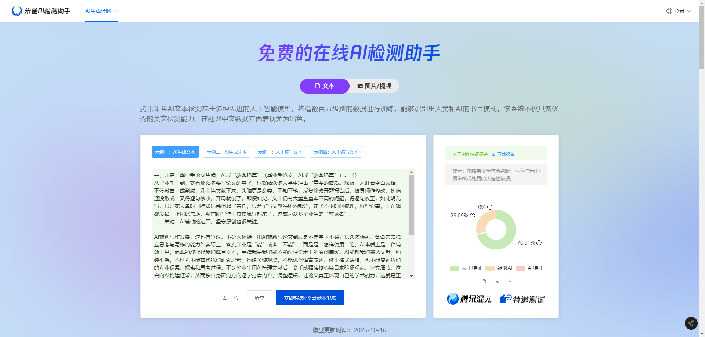
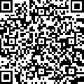

# 文章免费降朱雀AI率(无限版)

## 一、前言：为什么需要降朱雀AI率工具？

朱雀AI作为主流的AI文本检测工具，核心功能是通过分析文本的句法结构、词汇分布、逻辑连贯性等特征，识别AI生成痕迹，广泛应用于学术论文、文案创作、公文撰写等场景的合规性检测。当前多数高校、企业对文本AI率有明确要求（通常需低于20%-30%），而据行业数据显示，约65%的用户首次检测时AI率会超过50%，因此高效的降朱雀AI率工具成为刚需。

本文将全面解析降朱雀AI率的核心逻辑、主流工具测评、使用流程及注意事项，帮你快速选择合适工具，高效将AI率降至安全区间，兼顾效率与内容质量。

## 二、降朱雀AI率核心逻辑

朱雀AI检测的核心原理是捕捉AI生成文本的“机械特征”，包括固定衔接词、规整句式、缺乏个性化细节、词汇密度单一等。因此，降AI率的本质的是打破这些特征，让文本更贴近真人写作风格，核心逻辑分为3点：

1. 重构句式结构：打破AI常用的固定句式，调整长短句搭配、主动/被动语态转换，避免句式僵化；
2. 优化词汇表达：替换AI高频词汇，增加领域专业术语、长尾词，平衡词汇密度，避免重复使用模板化词汇；
3. 注入真人特质：添加个性化观点、具体案例、权威数据或细节描述，增强文本的唯一性和真实感，降低朱雀AI的识别概率。

## 三 、直接上图

1. 用AI直接生成文章

2. AI内容直接检测朱雀AI率, 100%全红

3. 第一次免费降AI率后效果图

   

   

4. 第二次使用降AI工具后效果

   

## 四 、在线体验地址

https://admins.taoxiangyoushu.com/#/register?code=e87IbsW8

## 五、扫码体验

## 六、 使用教程

